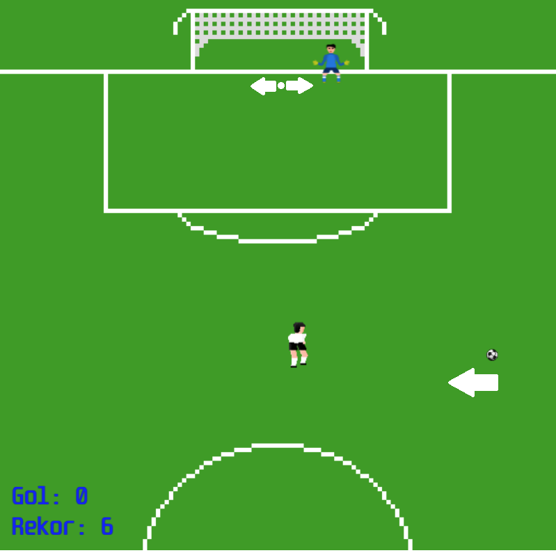
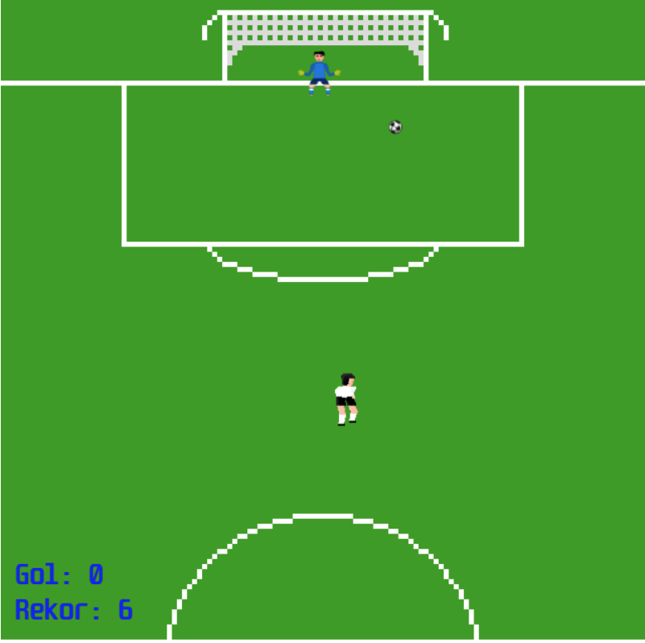
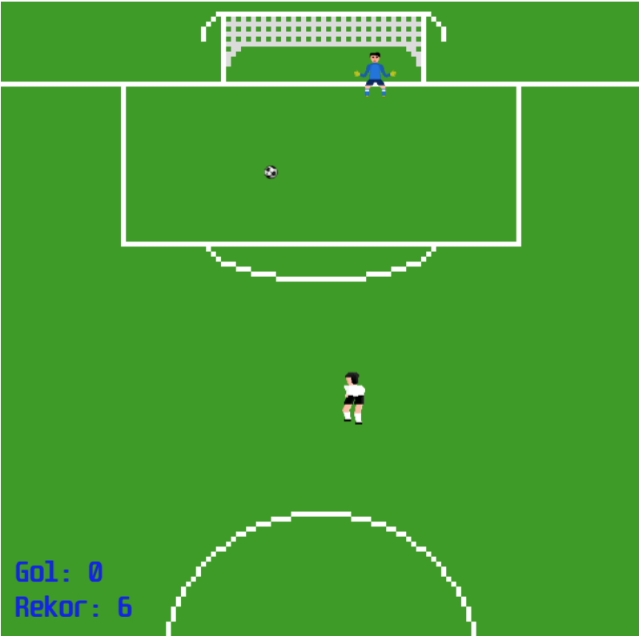

# Shoot a Volley
Shoot the ball right time, beat the goalkeeper and get score.

# Prerequisites
Shoot a Volley is a Javascript game. So you need to IDE for Javascript editing.

For play you need to web browser like Chrome, Firefox, Opera, Edge etc..

# Getting Started
Download project from Github and open index.html with your browser. The game should start.

# How to Play
Footballer is our character to move.

Right Arrow = Right Move

Left Arrow = Left Move

Space/Up Arrow = Shoot

# Game Rules
This is Game Scene.

Ball comes from right with constant speed.

Goalkeeper always moves from right post to left post.

If we shoot the ball exact time. The ball get direction from using footballer x position and ball x position difference reference and goes through a little bit right or left and forward.

If we shoot the ball from ball's left:

If we shoot the ball from ball's right:

Every goal increase score.

But the ball we shoot, touch the goalkeeper or go outside; score will be reset.

Condition of the game, score a goal as many as you can without miss.

# Built With

HTML - Canvas

Javascript - Source codes

Piskelapp.com - Scene, drawing objects and animation.

# Authors

Berkhan Özen

# License

This project is licensed under the MIT License. - see the LICENSE.md file for details.
